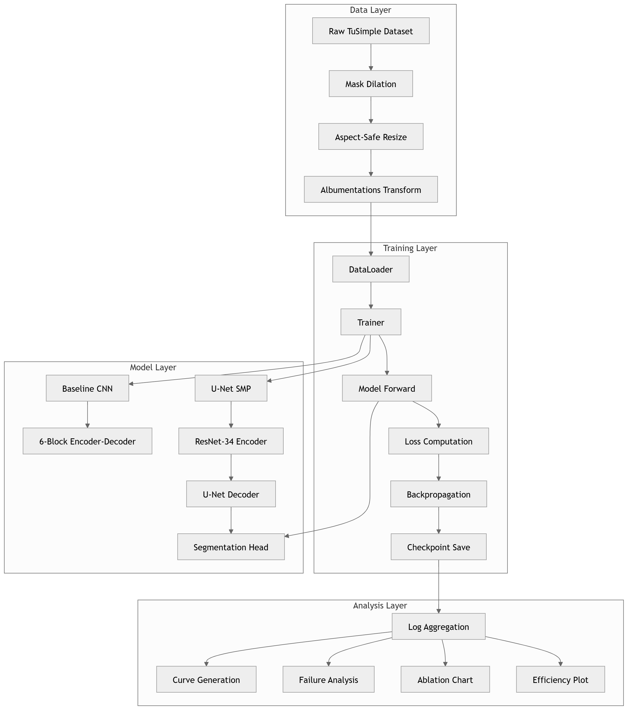
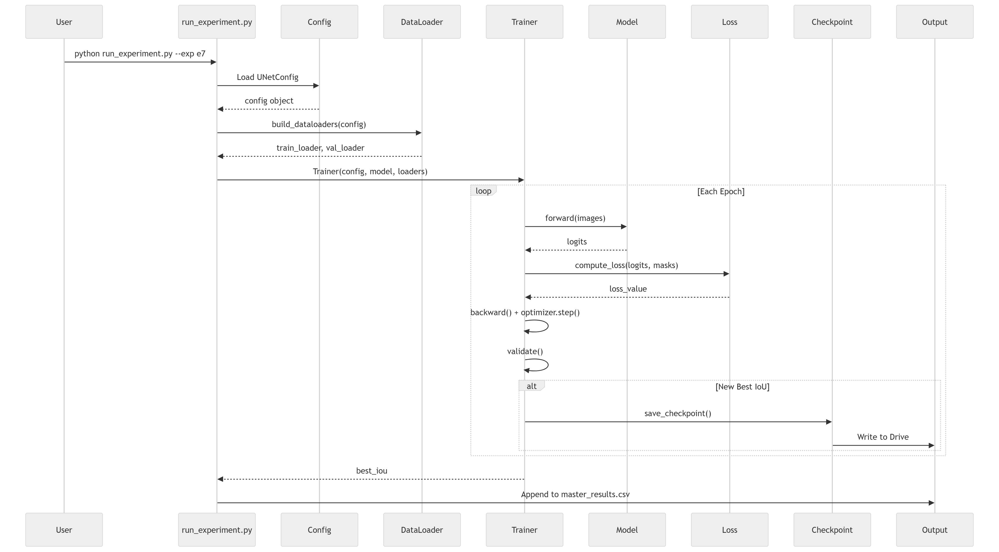
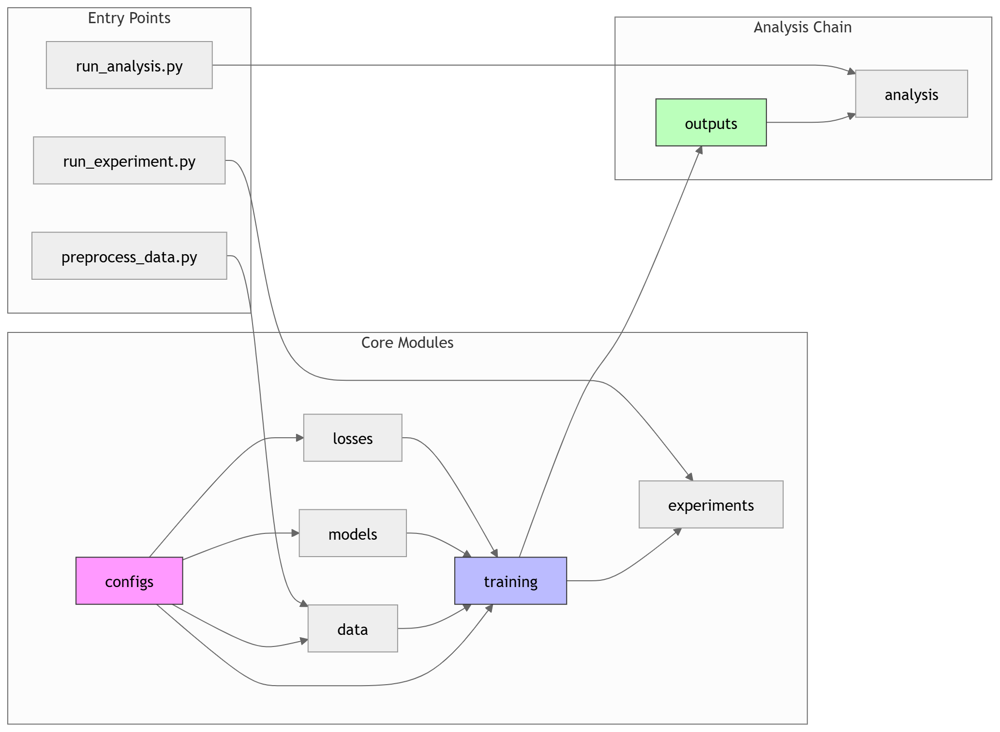
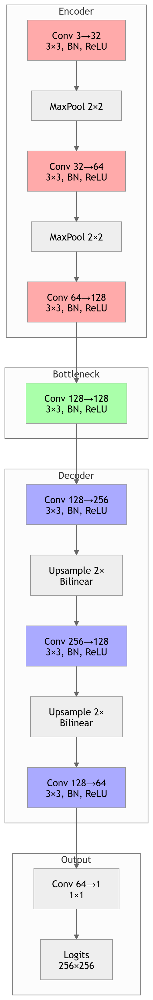
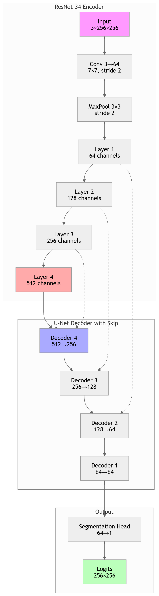
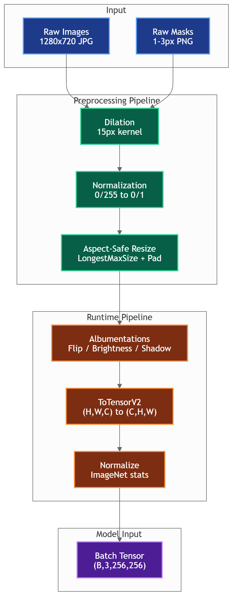
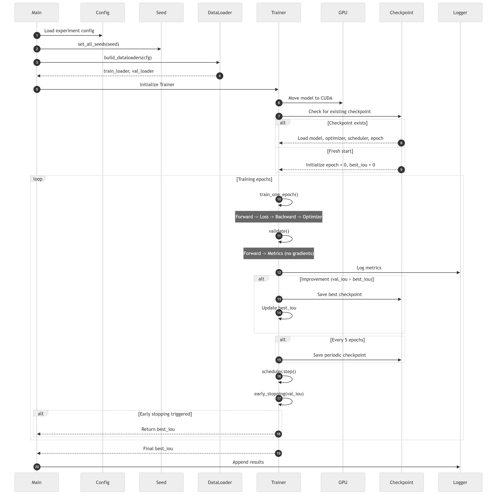
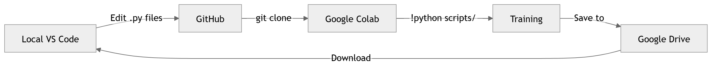

# UltraLane Detection

A modular, extensible deep learning framework for lane detection using semantic segmentation. Built with PyTorch, supporting multiple architectures including custom CNNs, U-Net from scratch, and pre-trained encoders.

---

## Architecture Overview

### System Architecture



The system follows a clean separation of concerns across **Data**, **Training**, and **Inference** pipelines.

---

### Component Interaction



Key components communicate through well-defined interfaces:

| Component | Responsibility |
|-----------|----------------|
| **Data Pipeline** | Loading, augmentation, preprocessing, validation |
| **Model Factory** | Architecture instantiation (CNN, U-Net, SMP) |
| **Trainer** | Training loop, checkpointing, logging |
| **Evaluator** | Metrics computation, visualization export |
| **Experiments** | Config management, hyperparameter sweeps |

---

### Module Connections



**Module Dependencies:**
- `configs/` → `training/`, `models/`, `data/`
- `models/` → `losses/`, `metrics/`
- `training/` → `utils/`, `metrics/`
- All modules → `utils/`

---

## Model Architectures

### 1. Baseline CNN (~200K parameters)

Simple 4-block encoder-decoder with bilinear upsampling. Serves as the performance floor.

```
Input [3, H, W]
    ↓
[ConvBlock 3→32] → MaxPool
    ↓
[ConvBlock 32→64] → MaxPool
    ↓
[ConvBlock 64→128] → Dropout
    ↓
Upsample → [ConvBlock 128→64]
    ↓
Upsample → [ConvBlock 64→32]
    ↓
Conv2d 32→1 [Output logits]
```



**File:** `models/baseline_cnn.py`

---

### 2. U-Net from Scratch (~31M parameters)

Full U-Net implementation with skip connections. Filters: [64, 128, 256, 512, 1024]

```
Input [3, H, W]
    ↓
┌─────────────┐
│  Encoder    │
│  DoubleConv │ → Skip Connections
│  MaxPool    │
└─────────────┘
    ↓
[Bottleneck 512→1024]
    ↓
┌─────────────┐
│  Decoder    │
│  ConvTrans  │
│  Concat+Skip│
│  DoubleConv │
└─────────────┘
    ↓
Conv2d 64→1 [Output logits]
```



**File:** `models/unet_scratch.py`

---

### 3. U-Net with Pre-trained Encoders (SMP)

Supports ResNet, EfficientNet, MobileNet backbones via `segmentation-models-pytorch`.

**File:** `models/unet_smp.py`

---

## Data Flow



```
Raw Images/Masks
       ↓
[Preprocessing]
   - Resize (256×256)
   - Normalization
       ↓
[Dataset Split] → Train / Val / Test
       ↓
[Augmentation Pipeline]
   - Light: Flip, Rotate, Brightness
   - Heavy: Elastic, GridDistortion, GaussNoise
       ↓
[DataLoader] → Model Training
```

---

## Execution Flow

### Runtime Flow



**Training Loop:**
1. Load config → Initialize model, optimizer, scheduler
2. Load datasets → Apply augmentations
3. For each epoch:
   - Training pass (with AMP if enabled)
   - Validation pass
   - Metrics logging
   - Checkpoint save (best + periodic)
4. Export results & visualizations

### Development Environment



Supports both local (VS Code) and cloud (Google Colab) development workflows.

---

## Configuration System

Centralized dataclass-based config (`configs/base.py`):

```python
@dataclass
class BaseConfig:
    experiment_name: str = "base"
    image_size: int = 256
    batch_size: int = 8
    epochs: int = 30
    learning_rate: float = 1e-3
    model_name: str = "baseline_cnn"
    loss_name: str = "combined"  # Dice + BCE
    ...
```

**Supported Losses:**
- `DiceBCELoss` — Combined Dice + Binary Cross Entropy
- `TverskyLoss` — Handles class imbalance
- `FocalLoss` — Focuses on hard examples
- `IoULoss` — Direct IoU optimization

---

## Quickstart

### Installation

```bash
pip install -r requirements.txt
pip install -e .
```

### Preprocess Data (one-time)

```bash
python scripts/preprocess_data.py --src /path/to/raw --dst /path/to/processed
```

### Run Experiment

```bash
# Baseline CNN
python scripts/run_experiment.py --exp e1

# U-Net from scratch
python scripts/run_experiment.py --exp e3

# Pre-trained U-Net with ResNet34
python scripts/run_experiment.py --exp e7
```

### Generate Analysis

```bash
python scripts/run_analysis.py
```
--- 